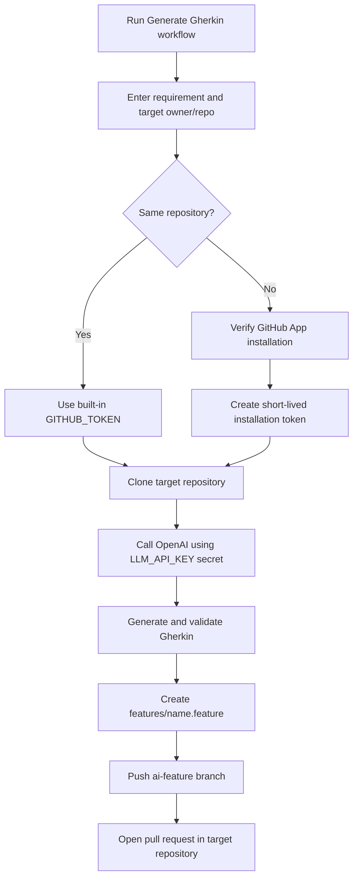

# Feature generation flow

## Required credentials

| Purpose | Configuration |
|---|---|
| OpenAI authentication | Repository secret `LLM_API_KEY` |
| Same-repository GitHub access | Built-in `GITHUB_TOKEN` |
| Cross-repository GitHub access | GitHub App variable `GH_APP_ID` and secret `GH_APP_PRIVATE_KEY` |

The target repository must already exist. For cross-repository generation, its
owner must install the GitHub App and authorize the target repository.
